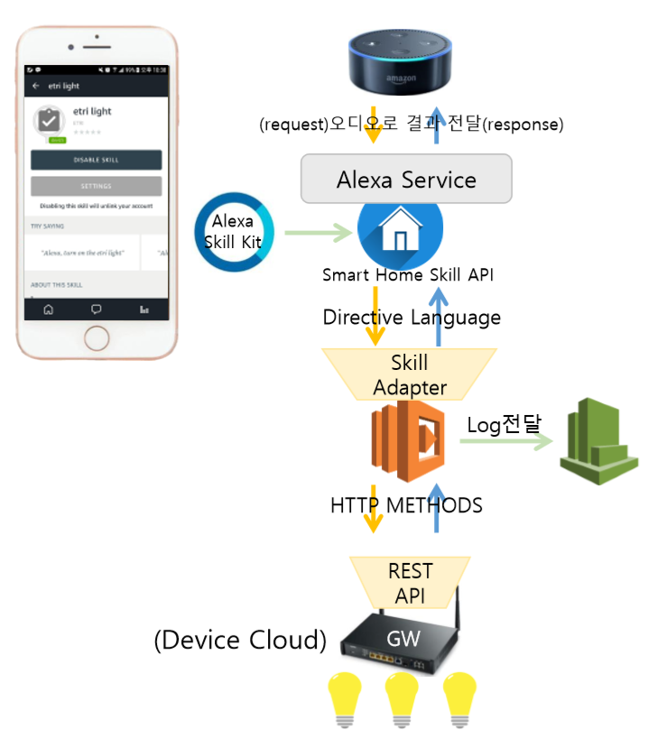
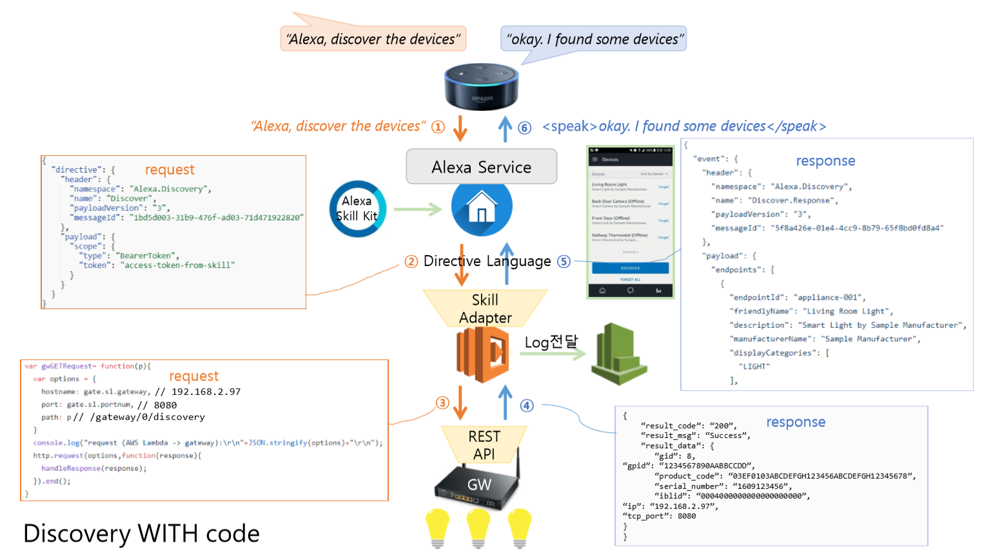
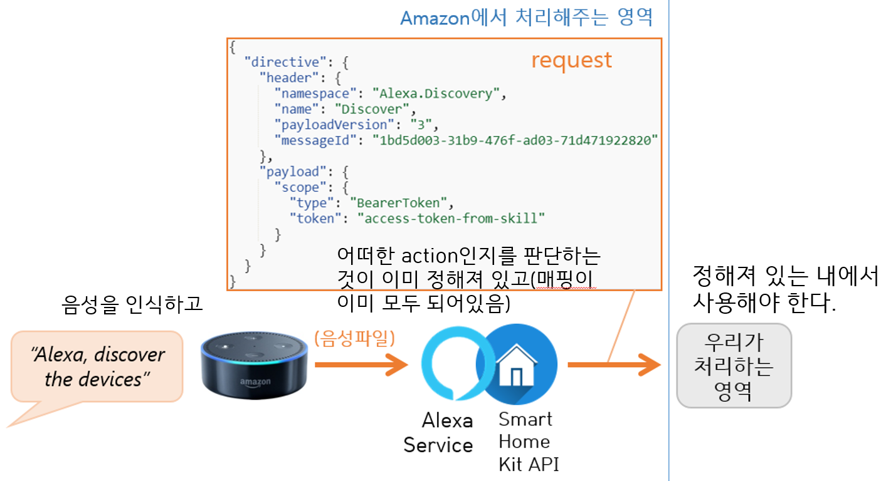

# system-light2.0
This is IoT service for system light 2.0 using Amazon's AI speaker __echo dot__.

This cotains main light controlling code  and also system light 2.0 simulator and Alexa Service request simulator.

You can see code description in [here](https://docs.google.com/document/d/1hajuK4yoB7gbIvkzl0Hl96l0xCGfJwlaoeGf-agEu2A/edit?usp=sharing).

##Network Flow

##Request Response example in Discovery

##Smart Home Skill API

